# Clinica Microservice CI/CD Pipeline

This directory contains a comprehensive CI/CD pipeline for the Clinica microservice, implementing industry best practices for automated testing, security scanning, containerization, and deployment to AWS EKS.

## Pipeline Visualization

```mermaid
graph TD
    A[Code Push/PR] --> B[CI Pipeline Trigger]

    subgraph CI_Pipeline [CI Pipeline]
        B --> C[Checkout Code]
        C --> D[Setup JDK 21]
        D --> E[Cache Gradle]
        E --> F[Build Application]
        F --> G[Unit Tests]
        G --> H[JaCoCo Coverage]
        H --> I[Codecov Upload]

        I --> J[Integration Tests]
        J --> K[Acceptance Tests]

        K --> L[SonarQube Analysis]
        L --> M[Quality Gate Check]

        M --> N[Trivy Security Scan]
        N --> O[Dependency Check]
        O --> P[License Check]

        P --> Q[Build Docker Image]
        Q --> R[Test Docker Container]
        R --> S[Upload Artifacts]

        S --> T[CI Success]
    end

    subgraph CD_Pipeline [CD Pipeline]
        T --> U[CD Pipeline Trigger]

        U --> V[Build & Push Docker Image]
        V --> W[Deploy to Staging]
        W --> X[Smoke Tests]
        X --> Y[Performance Tests]

        Y --> Z[Deploy to Production]
        Z --> AA[Production Smoke Tests]
        AA --> BB[Notifications]
    end

    %% Styling
    classDef trigger fill:#e1f5fe
    classDef build fill:#f3e5f5
    classDef test fill:#e8f5e8
    classDef quality fill:#fff3e0
    classDef security fill:#ffebee
    classDef deploy fill:#f3e5f5
    classDef success fill:#e8f5e8

    class A,B,U trigger
    class C,D,E,F,V,W,Z build
    class G,H,I,J,K,X,Y,AA test
    class L,M quality
    class N,O,P security
    class Q,R,S deploy
    class T,BB success
```



### Pipeline Flow Explanation

1. **Trigger**: Code push or PR to main/develop branches
2. **CI Pipeline**:
   - Code checkout and environment setup
   - Build and unit testing with coverage
   - Integration and acceptance testing
   - Code quality analysis (SonarQube)
   - Security scanning and compliance checks
   - Container building and testing
3. **CD Pipeline** (on CI success):
   - Docker image build and push to DockerHub
   - Staging deployment with smoke and performance tests
   - Production deployment with final validation

## Overview

The pipeline includes the following stages and tools:

- **Version Control**: GitHub
- **CI/CD Platform**: GitHub Actions
- **Code Quality**: SonarQube
- **Testing**: Unit, Integration, Acceptance, Load, and Performance tests
- **Security**: Trivy vulnerability scanning, OWASP Dependency Check
- **Containerization**: Docker with multi-stage builds
- **Registry**: DockerHub
- **Infrastructure**: Terraform for AWS EKS setup
- **Deployment**: Kubernetes with staging and production environments
- **Monitoring**: Basic health checks and smoke tests

## Pipeline Architecture

### CI Pipeline (`.github/workflows/ci.yml`)

Triggered on pushes and PRs to `main` and `develop` branches.

#### Stages:

1. **Build & Test**
   - Checkout code
   - Setup JDK 21
   - Cache Gradle dependencies
   - Build application with Gradle
   - Run unit tests
   - Generate JaCoCo coverage reports
   - Upload coverage to Codecov

2. **Integration Testing**
   - Start PostgreSQL service
   - Run integration tests with test database

3. **Acceptance Testing**
   - Run RestAssured-based acceptance tests
   - Test against running application

4. **Code Quality & Security**
   - SonarQube analysis with quality gate
   - Trivy security scanning
   - OWASP Dependency Check
   - License compliance checking

5. **Container Testing**
   - Build Docker image
   - Test container health checks
   - Upload test artifacts

### CD Pipeline (`.github/workflows/cd.yml`)

Triggered on successful CI completion and pushes to `main`.

#### Stages:

1. **Build & Push**
   - Build multi-stage Docker image
   - Push to DockerHub with multiple tags

2. **Deploy to Staging**
   - Configure AWS credentials
   - Update EKS kubeconfig
   - Deploy to staging environment
   - Run smoke tests
   - Execute performance tests

3. **Deploy to Production**
   - Deploy to production environment
   - Run production smoke tests
   - Send deployment notifications

## Prerequisites

### Required Secrets (GitHub Repository)

```bash
# SonarQube
SONAR_TOKEN
SONAR_HOST_URL

# DockerHub
DOCKERHUB_USERNAME
DOCKERHUB_TOKEN

# AWS
AWS_ACCESS_KEY_ID
AWS_SECRET_ACCESS_KEY

# Codecov (optional)
CODECOV_TOKEN
```

### Required Tools

- Docker
- kubectl
- awscli
- terraform
- JMeter (for local testing)

### Infrastructure Setup

1. **AWS EKS Clusters**

   ```bash
   cd terraform
   terraform init
   terraform plan
   terraform apply
   ```

2. **Configure kubectl**
   ```bash
   aws eks update-kubeconfig --name clinica-staging-cluster --region us-east-1
   aws eks update-kubeconfig --name clinica-prod-cluster --region us-east-1
   ```

## Directory Structure

```
ci-cd/
├── .github/workflows/
│   ├── ci.yml          # CI pipeline
│   └── cd.yml          # CD pipeline
├── k8s/
│   ├── staging/        # Staging environment manifests
│   └── production/     # Production environment manifests
├── load-tests/         # JMeter load testing scripts
├── performance-tests/  # JMeter performance testing scripts
├── src/
│   ├── acceptanceTest/ # RestAssured acceptance tests
│   └── integrationTest/# Integration tests
├── terraform/          # Infrastructure as Code
├── sonar-project.properties  # SonarQube configuration
├── Dockerfile          # Multi-stage Docker build
├── build.gradle        # Gradle build configuration
└── README.md           # This file
```

## Testing Strategy

### Unit Tests

- Framework: JUnit 5
- Coverage: JaCoCo
- Location: `src/test/java/`

### Integration Tests

- Test database interactions
- Location: `src/integrationTest/java/`
- Uses PostgreSQL in CI

### Acceptance Tests

- API contract testing with RestAssured
- Location: `src/acceptanceTest/java/`
- Tests full application stack

### Load Tests

- Tool: Apache JMeter
- Configuration: `load-tests/clinica-load-test.jmx`
- Simulates 50 concurrent users

### Performance Tests

- Tool: Apache JMeter
- Configuration: `performance-tests/clinica-performance-test.jmx`
- Tests response times under load

## Deployment Environments

### Staging

- Cluster: `clinica-staging-cluster`
- Namespace: `default`
- Replicas: 2
- Resources: 512Mi RAM, 0.25 CPU

### Production

- Cluster: `clinica-prod-cluster`
- Namespace: `default`
- Replicas: 3
- Resources: 1Gi RAM, 0.5 CPU

## Security Measures

- **Container Scanning**: Trivy scans for vulnerabilities
- **Dependency Checking**: OWASP Dependency Check for known vulnerabilities
- **License Compliance**: Automated license checking
- **Secrets Management**: GitHub Secrets for sensitive data
- **RBAC**: AWS IAM roles for EKS access

## Monitoring & Observability

- Health checks: `/actuator/health`
- Readiness probes for zero-downtime deployments
- Basic smoke tests post-deployment
- Performance metrics collection

## Usage

### Running Locally

1. **Build and Test**

   ```bash
   ./gradlew build
   ./gradlew test
   ```

2. **Run Acceptance Tests**

   ```bash
   ./gradlew acceptanceTest
   ```

3. **Load Testing**

   ```bash
   jmeter -n -t load-tests/clinica-load-test.jmx
   ```

4. **Performance Testing**
   ```bash
   jmeter -n -t performance-tests/clinica-performance-test.jmx
   ```

### Manual Deployment

1. **Build Docker Image**

   ```bash
   docker build -t clinica:latest .
   ```

2. **Push to DockerHub**

   ```bash
   docker tag clinica:latest srikanthkakumanu/clinica:latest
   docker push srikanthkakumanu/clinica:latest
   ```

3. **Deploy to Kubernetes**
   ```bash
   kubectl apply -f k8s/staging/
   ```

## Troubleshooting

### Common Issues

1. **SonarQube Quality Gate Failure**
   - Check code coverage and code smells
   - Review SonarQube dashboard for details

2. **Docker Build Failures**
   - Ensure Docker daemon is running
   - Check build logs for dependency issues

3. **EKS Deployment Issues**
   - Verify AWS credentials and permissions
   - Check kubectl context: `kubectl config current-context`

4. **Test Failures**
   - Check application logs
   - Verify test database connectivity
   - Review test configuration

### Logs and Debugging

- **CI Logs**: Available in GitHub Actions tab
- **Application Logs**: `kubectl logs -f deployment/clinica-staging`
- **EKS Cluster Logs**: AWS CloudWatch or `kubectl logs`

## Contributing

1. Create feature branch from `develop`
2. Make changes with tests
3. Ensure CI passes
4. Create PR to `main`
5. Review and merge

## Additional Resources

- [Clinica Microservice Repository](https://github.com/srikanthkakumanu/clinica)
- [GitHub Actions Documentation](https://docs.github.com/en/actions)
- [SonarQube Documentation](https://docs.sonarsource.com/sonarqube/)
- [AWS EKS Documentation](https://docs.aws.amazon.com/eks/)
- [Terraform AWS EKS Module](https://registry.terraform.io/modules/terraform-aws-modules/eks/aws)
